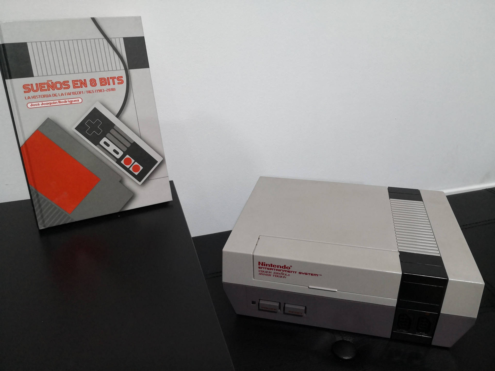
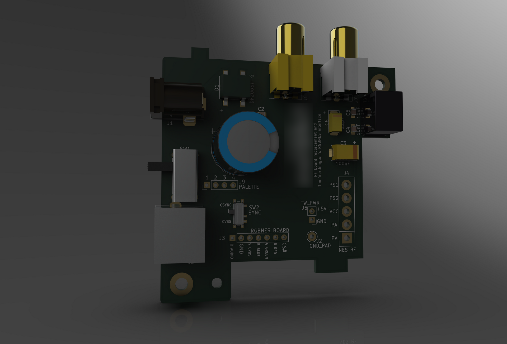
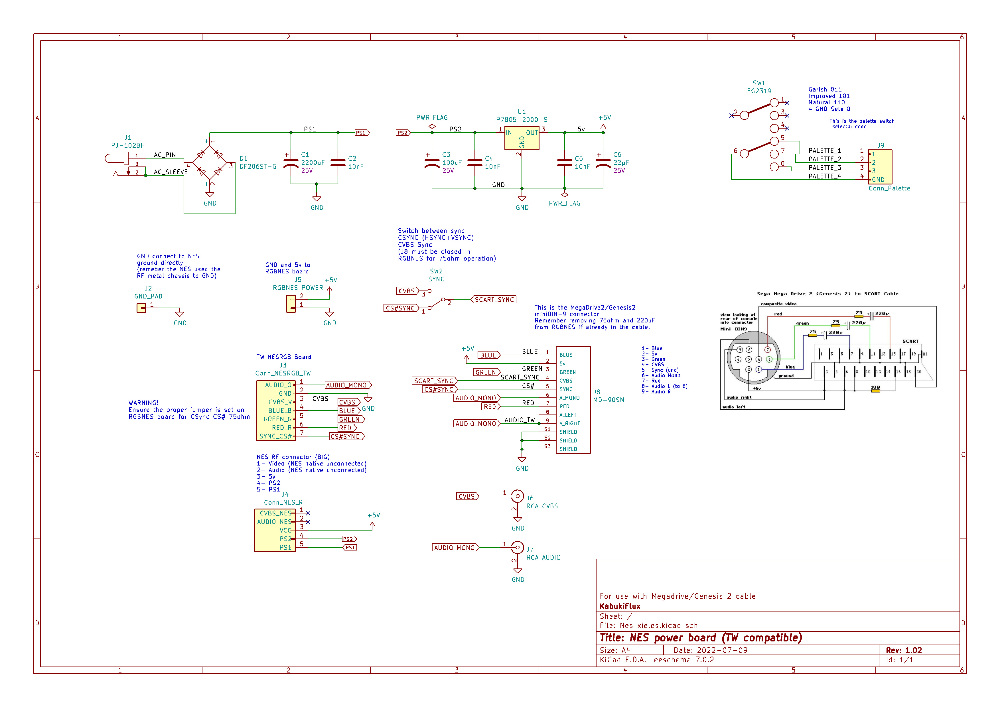
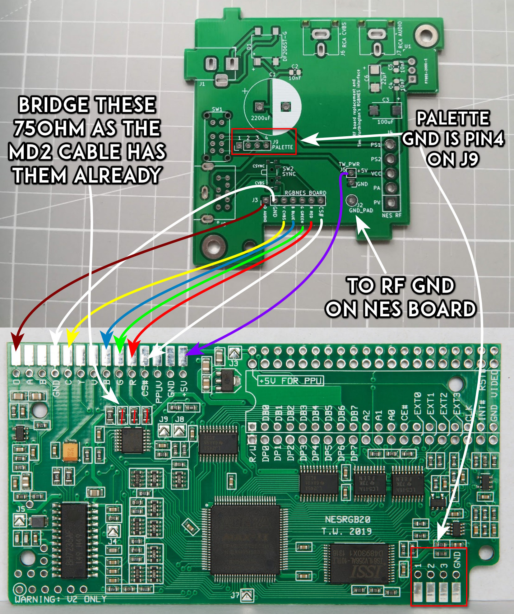
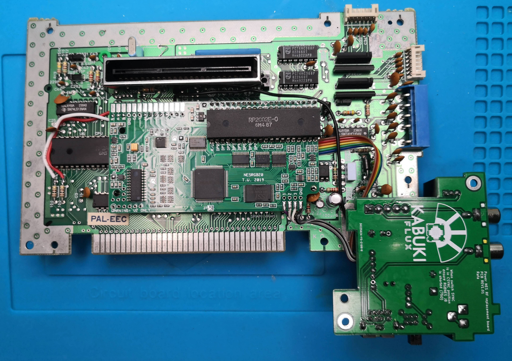
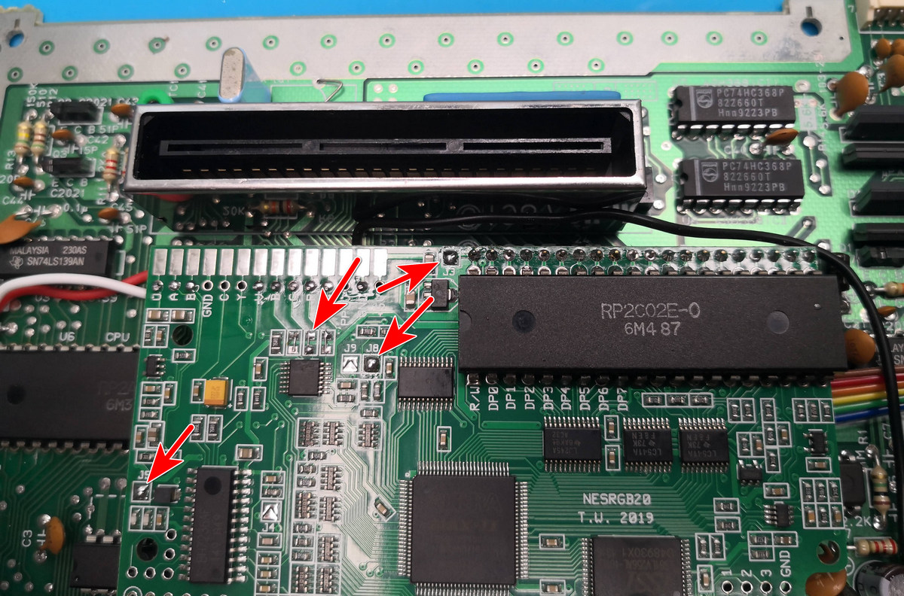
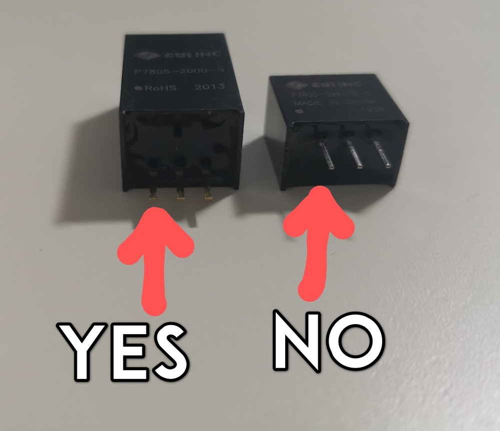
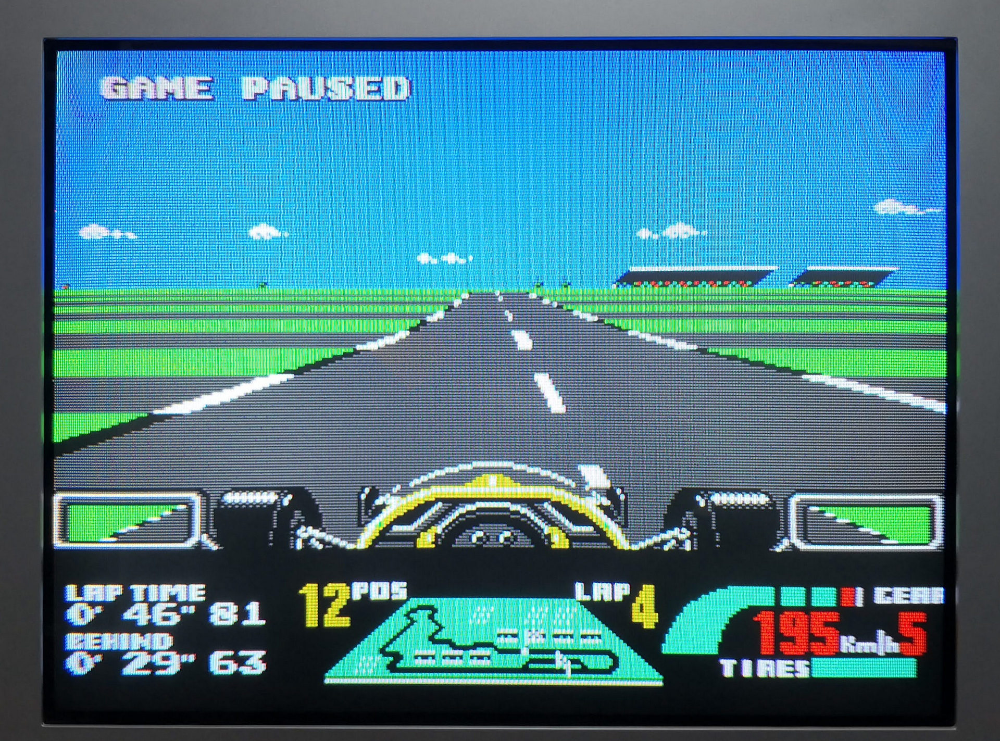
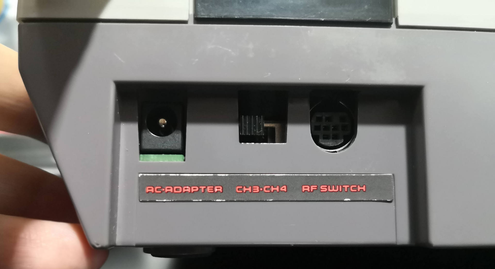
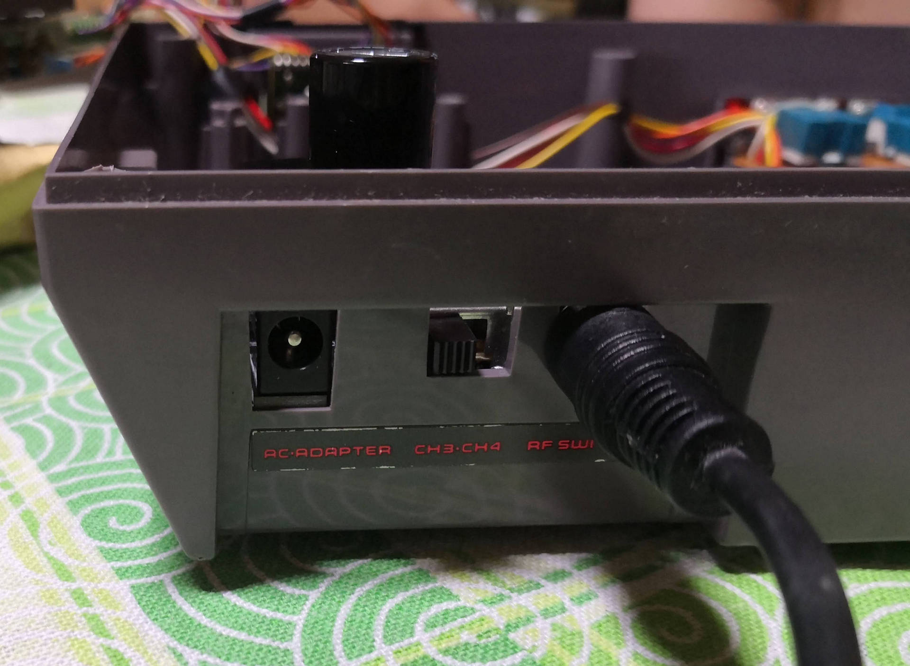

# NES IO Board "nessionator"

<b align="center">Nessionator, the RGB mod NES output board 
complement for Tim Worthington's NesRGB board</b>

## Table of contents

- [Why](#why)
- [Description](#description)
- [Schematics](#schematics)
- [Install](#install)
- [Pics and final result](#pics-and-final-result)

## Why?

In order to preserve the Nintendo Entertainment System some actions are required like the recapping of the components
cleaning, etc..., one way to ensure compatibility with modern TVs and improve the
image as well is by installing the Tim Worthington's NESRGB board, which interfaces between
the PPU and a CPLD to convert digital into analog signals with multiple palettes.

## Description

This is intended to be a PCB to use with the Tim Worthington's RGB board with a standard NES from regions USA and Europe
without having to do any holes on the case.

This board uses a standard Sega Megadrive 2 RGB cable (Sega Genesis).

No cut is required on the case, so we left the outside of the console untouched.

In the BOM directory there's an interactive BOM with all the required components.

In the gerbers directory we have the gerbers to manufacture the boards.

In the KiCAD folder we can find the KiCAD project itself.

## Schematics

You can find here as well the MD2 cable schematics inside.

## Install

1- Send to manufacture the GERBER board to JLCPCB or other PCB manufacturer.

2- Get the components required, you can see here the Bill Of Materials [BOM](bom/ibom.html)

3- Solder the components.

4- Desolder the RF from the NES but save the header pins connecting the mainboard to the RF board.

5- Follow Tim Wothington's install guide here but do not cut the case!!!: [Guide](https://etim.net.au/nesrgb/installation-nes/) 

6- Follow this soldering guide:

At this stage you should have something like this:

This is a pic with the NESRGB installed for NTSC 60Hz, check the manual for PAL.

Remember to bridge the output 75 ohm resistors as the MD2 cable already has them inside.

* Be careful with the DCDC switching supply IC

### Pics and final result

I know, not the best shot showing the RGB.

 

 

I'm not responsible
============
And yes, read below, no responsibility taken on bad use.

DISCLAIMER (MIT Licensing)
==========================
Permission to use, copy, modify, and distribute this software for any
purpose with or without fee is hereby granted, provided that the above
copyright notice and this permission notice appear in all copies.

The software is provided "as is" and the author disclaims all warranties
with regard to this software including all implied warranties of
merchantability and fitness. In no event shall the author be liable for
any special, direct, indirect, or consequential damages or any damages
whatsoever resulting from loss of use, data or profits, whether in an
action of contract, negligence or other tortious action, arising out of
or in connection with the use or performance of this software.